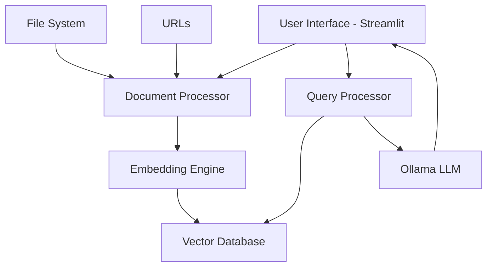
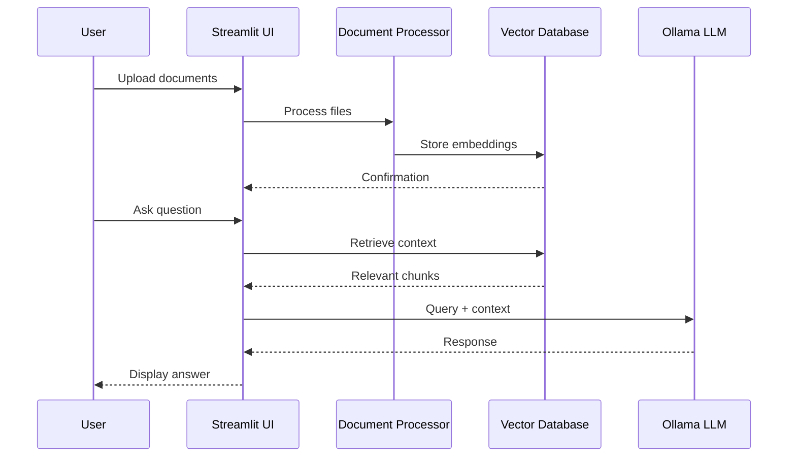

# 🤖 Documentation Helper Agent - Hands-On Learning Guide

## 📚 Learning Objectives
By the end of this hands-on session, you will:
- Understand the complete SDLC process for AI agent development
- Build a functional documentation helper agent from scratch
- Learn to integrate local LLMs with vector databases
- Create an intuitive user interface for AI applications

---

## 🎯 PHASE 1: PLAN - Problem Definition & Analysis

### Problem Statement
Create an intelligent documentation helper agent that can:
- Load and process documentation from various sources
- Answer questions about specific open-source projects
- Provide contextual responses using embeddings
- Gracefully handle queries without loaded documentation

### Requirements Analysis

#### Functional Requirements
1. **Document Ingestion**
   - Support .txt, .pdf, .md files
   - Accept file uploads or directory paths
   - Process multiple documents simultaneously

2. **Vector Database**
   - Create embeddings from documents
   - Store and retrieve context efficiently
   - Handle incremental updates

3. **Chat Interface**
   - Natural language query processing
   - Context-aware responses
   - Conversation history

4. **LLM Integration**
   - Use Ollama for local processing
   - Maintain conversation context
   - Provide fallback responses

#### Non-Functional Requirements
- **Performance**: Fast response times (<5 seconds)
- **Usability**: Intuitive interface for beginners
- **Reliability**: Graceful error handling
- **Scalability**: Handle large documentation sets

### Success Metrics
- ✅ Agent responds accurately to documentation queries
- ✅ UI is intuitive for non-technical users
- ✅ Setup process is reproducible
- ✅ Handles edge cases gracefully

---

## 🏗️ PHASE 2: DESIGN - System Architecture

### High-Level Architecture



### Component Design

#### 1. Document Processor
- **Input**: Files (.txt, .pdf, .md), URLs, directory paths
- **Processing**: Text extraction, chunking, cleaning
- **Output**: Structured text chunks

#### 2. Embedding Engine
- **Model**: Sentence transformers or Ollama embeddings
- **Chunking Strategy**: Semantic chunking with overlap
- **Storage**: Vector database (ChromaDB/FAISS)

#### 3. Query Engine
- **Retrieval**: Semantic similarity search
- **Ranking**: Relevance scoring
- **Context**: Top-k relevant chunks

#### 4. LLM Integration
- **Model**: Ollama (configurable model)
- **Prompting**: System prompt + context + query
- **Response**: Contextual answers

### Data Flow Design



---

## ⚙️ PHASE 3: DEVELOP - Implementation

### Development Environment Setup

#### Prerequisites
```bash
# Python 3.8+
python --version

# Install Ollama
curl -fsSL https://ollama.ai/install.sh | sh

# Pull a model
ollama pull llama2:7b-chat
```

#### Project Structure
```
documentation_helper/
├── app.py                 # Main Streamlit application
├── src/
│   ├── __init__.py
│   ├── document_processor.py
│   ├── embedding_engine.py
│   ├── vector_db.py
│   └── llm_client.py
├── data/                  # Local document storage
├── embeddings/           # Vector database storage
├── requirements.txt
└── README.md
```

### Implementation Phases

#### Phase 1: Basic UI and File Handling
- Create Streamlit interface
- Implement file upload functionality
- Basic document reading capabilities

#### Phase 2: Document Processing and Embeddings
- Text extraction from multiple formats
- Chunking strategies
- Embedding generation and storage

#### Phase 3: LLM Integration
- Ollama client setup
- Context-aware prompting
- Response generation

#### Phase 4: Integration and Polish
- Connect all components
- Error handling and validation
- UI improvements

---

## 🧪 PHASE 4: TEST - Validation and Quality Assurance

### Testing Strategy

#### Unit Tests
- Document processing functions
- Embedding generation
- Vector database operations
- LLM client functionality

#### Integration Tests
- End-to-end workflow
- File upload to response generation
- Error scenarios

#### User Acceptance Tests
- Load sample documentation
- Test various query types
- Validate response quality
- UI usability testing

### Test Scenarios

#### Scenario 1: Empty State
- **Given**: No documents loaded
- **When**: User asks a question
- **Then**: Agent provides general response about the project

#### Scenario 2: Single Document
- **Given**: One markdown file loaded
- **When**: User asks specific question
- **Then**: Agent provides contextual answer

#### Scenario 3: Multiple Documents
- **Given**: Mixed file types loaded
- **When**: User asks complex question
- **Then**: Agent synthesizes information from multiple sources

#### Scenario 4: Edge Cases
- **Given**: Corrupted files, large documents, network issues
- **When**: Various error conditions
- **Then**: Graceful error handling with user feedback

---

## 🚀 Getting Started

### Step 1: Environment Setup
Follow the installation guide in the next section to set up your development environment.

### Step 2: Implementation
Work through each development phase systematically, testing as you go.

### Step 3: Customization
Adapt the agent for your assigned open-source project by:
- Updating the system prompt
- Configuring project-specific settings
- Loading relevant documentation

### Step 4: Testing and Validation
Run through all test scenarios to ensure your agent works correctly.

---

## 📝 Learning Checkpoints

After each phase, ask yourself:
- [ ] Do I understand the purpose of this phase?
- [ ] Can I explain the technical decisions made?
- [ ] What would I do differently?
- [ ] How does this phase connect to the others?

---

## 💻 IMPLEMENTATION WALKTHROUGH

### Phase 1: Environment Setup and Project Structure

#### Step 1.1: Install Prerequisites

```bash
# Install Ollama
curl -fsSL https://ollama.ai/install.sh | sh

# Pull a language model
ollama pull llama2:7b-chat

# Verify installation
ollama list
```

#### Step 1.2: Create Project Structure

```bash
# Create project directory
mkdir documentation_helper
cd documentation_helper

# Create directory structure
mkdir -p src data embeddings

# Create files
touch app.py requirements.txt README.md
touch src/__init__.py src/document_processor.py src/vector_db.py src/llm_client.py
```

#### Step 1.3: Setup Dependencies

Create `requirements.txt`:
```
streamlit==1.29.0
langchain==0.1.0
langchain-community==0.0.10
chromadb==0.4.22
sentence-transformers==2.2.2
pypdf2==3.0.1
python-docx==0.8.11
requests==2.31.0
beautifulsoup4==4.12.2
ollama==0.1.7
python-dotenv==1.0.0
```

Install dependencies:
```bash
pip install -r requirements.txt
```

### Phase 2: Document Processing Implementation

#### Step 2.1: Document Processor Class

Key learning points:
- **File Format Handling**: Different approaches for .txt, .md, .pdf, .docx
- **Error Handling**: Graceful failure when libraries missing
- **Text Chunking**: Strategy for breaking large documents

Implementation highlights in `src/document_processor.py`:

```python
class DocumentProcessor:
    def __init__(self):
        self.supported_extensions = ['.txt', '.md', '.pdf', '.docx']
    
    def chunk_document(self, document, chunk_size=1000, overlap=200):
        # Smart chunking that respects sentence boundaries
        # Overlap ensures context preservation between chunks
```

#### Step 2.2: Testing Document Processing

Create test file `data/sample_documentation.md` and test:

```python
# Test script
processor = DocumentProcessor()
docs = processor.load_from_directory('./data')
chunks = processor.chunk_document(docs[0])
print(f"Processed {len(chunks)} chunks")
```

### Phase 3: Vector Database Implementation

#### Step 3.1: ChromaDB Integration

Key concepts:
- **Embeddings**: Converting text to numerical vectors
- **Similarity Search**: Finding relevant content using cosine similarity
- **Persistence**: Storing embeddings for future use

Implementation in `src/vector_db.py`:

```python
class VectorDatabase:
    def __init__(self, persist_directory="./embeddings"):
        self.embedding_model = SentenceTransformer('all-MiniLM-L6-v2')
        self.client = chromadb.PersistentClient(path=persist_directory)
```

#### Step 3.2: Understanding Embeddings

Learning exercise:
1. Generate embeddings for sample text
2. Compare similarity scores between related/unrelated content
3. Experiment with different embedding models

### Phase 4: LLM Integration

#### Step 4.1: Ollama Client

Key concepts:
- **Local LLM**: Benefits of running models locally
- **Prompt Engineering**: Crafting effective system prompts
- **Context Window**: Managing context size limits

Implementation in `src/llm_client.py`:

```python
class OllamaClient:
    def generate_response(self, question, context, project_name, project_description):
        # Combines context with system prompt
        # Handles fallback when no context available
```

#### Step 4.2: Prompt Engineering

Learn to craft effective prompts:

```python
system_prompt = """You are a helpful documentation assistant for {project_name}.

{project_description}

Instructions:
- Answer questions clearly and concisely
- Use provided context when available
- If no context available, use general knowledge
- Be honest about limitations
"""
```

### Phase 5: Streamlit UI Development

#### Step 5.1: Basic Interface

Key UI concepts:
- **Session State**: Maintaining state across interactions
- **Sidebar**: Configuration and controls
- **File Upload**: Handling multiple file types
- **Chat Interface**: User-friendly conversation flow

#### Step 5.2: Advanced Features

```python
# File upload with progress
uploaded_files = st.file_uploader(
    "Upload Documents",
    type=['txt', 'md', 'pdf', 'docx'],
    accept_multiple_files=True
)

# Dynamic model selection
available_models = st.session_state.llm_client.get_available_models()
selected_model = st.selectbox("Select Model", available_models)
```

### Phase 6: Integration and Testing

#### Step 6.1: Component Integration

Connect all components in `app.py`:

1. **Initialize Components**: Create instances in session state
2. **Document Flow**: Upload → Process → Embed → Store
3. **Query Flow**: Question → Search → Context → LLM → Response

#### Step 6.2: Testing Strategy

Follow `test_scenarios.md` for comprehensive testing:

1. **Empty State Testing**: No documents loaded
2. **Single Document**: Basic functionality
3. **Multiple Documents**: Complex queries
4. **Error Handling**: Edge cases
5. **Performance**: Response times
6. **User Experience**: Interface usability

### Phase 7: Customization for Different Projects

#### Step 7.1: Project-Specific Configuration

For each team's project:

1. **Update Project Settings**:
   ```python
   project_name = "Your Project Name"
   project_description = "Detailed description of the project"
   ```

2. **Load Project Documentation**:
   - Clone project repository
   - Load docs/ directory
   - Process README files

3. **Test Project-Specific Queries**:
   - Installation instructions
   - Configuration options
   - API documentation
   - Troubleshooting guides

#### Step 7.2: Advanced Customizations

```python
# Custom system prompt for specific project types
def get_project_prompt(project_type):
    prompts = {
        'web_framework': "You are an expert in web development...",
        'ml_library': "You are a machine learning specialist...",
        'devops_tool': "You are a DevOps engineer..."
    }
    return prompts.get(project_type, default_prompt)
```

---

## 🔍 SDLC REFLECTION CHECKPOINTS

### After Each Phase

1. **Plan Review**: Did we achieve phase objectives?
2. **Design Validation**: Are components working as designed?
3. **Implementation Quality**: Is code maintainable and extensible?
4. **Testing Coverage**: Are we catching edge cases?

### Key Learning Questions

1. **Planning**: How did requirements translate to implementation?
2. **Design**: What architectural decisions proved most important?
3. **Development**: Which implementation challenges were unexpected?
4. **Testing**: What edge cases did we discover?

### Continuous Improvement

- **Code Review**: What would you implement differently?
- **Performance**: Where are the bottlenecks?
- **User Experience**: How can the interface be improved?
- **Scalability**: How would this handle larger datasets?

---

## 🚀 DEPLOYMENT AND PRODUCTION

### Local Deployment

```bash
# Run the application
streamlit run app.py

# Access at http://localhost:8501
```

### Production Considerations

1. **Security**: API keys, authentication
2. **Performance**: Caching, optimization
3. **Monitoring**: Logging, error tracking
4. **Scalability**: Database optimization, load balancing

### Docker Deployment

```dockerfile
FROM python:3.9-slim

WORKDIR /app
COPY requirements.txt .
RUN pip install -r requirements.txt

COPY . .
EXPOSE 8501

CMD ["streamlit", "run", "app.py", "--server.port=8501", "--server.address=0.0.0.0"]
```

---

## 📚 ADDITIONAL LEARNING RESOURCES

### Technical Deep Dives

- **Vector Databases**: Understanding embeddings and similarity search
- **LLM Prompting**: Advanced prompt engineering techniques
- **Streamlit**: Building interactive web applications
- **Document Processing**: Handling various file formats

### Project Extensions

1. **Multi-language Support**: Translate documentation
2. **Version Control**: Track documentation changes
3. **Analytics**: Usage patterns and popular queries
4. **Integration**: Connect with documentation platforms

### Career Applications

- **Portfolio Project**: Demonstrate full-stack AI development
- **Technical Skills**: Vector databases, LLMs, web development
- **Problem Solving**: End-to-end solution design
- **Documentation**: Technical writing and user guides

---

*This comprehensive hands-on guide provides step-by-step instructions for building a production-ready Documentation Helper Agent while learning fundamental AI agent development concepts.*
